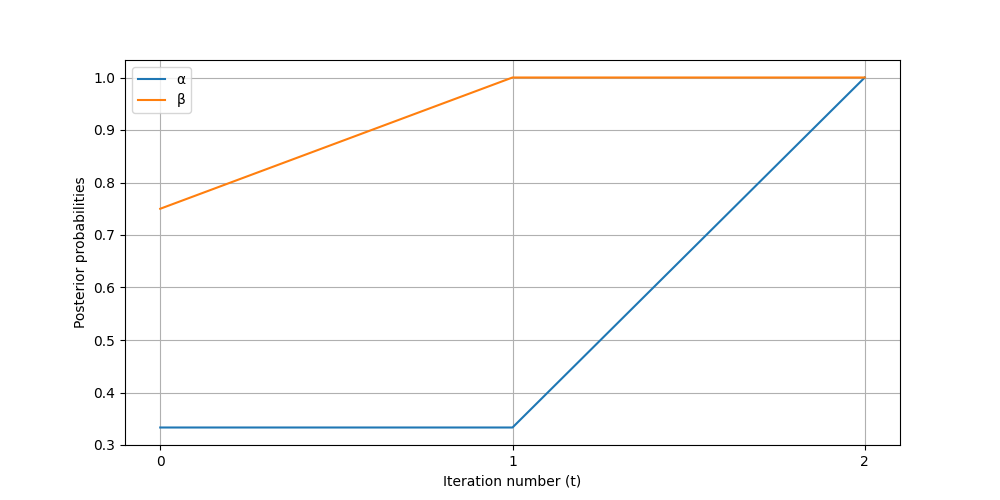

This paper introduces an algorithm for the automatic simulation of Bayesian dialogues [1]. Bayesian dialogs is useful framework in game theory for modeling interactions, and in particular consensus reaching between agents in my contexts, e.g., to model trader interactions with financial markets [3], or social interactions [4]. The algorithm allows for the generation of dialogues that embody Bayesian reasoning. In addition to detailing the algorithm’s implementation and key features, we explore the probability of the emergence of non-trivial Bayesian dialogues by conducting random simulations on a vast sample of dialogues. The evaluation of the algorithm provides insights into its performance and the effectiveness of its simulations, underscoring its capability to encapsulate the core of Bayesian reasoning.

This work was presented at the Paris Workshop on Games, Decisions, and Language ([link](https://game-theory.u-paris2.fr/WS2023-program.html)) *Simulating Bayesian Dialogues* by Arsen Pidburachynskyi. The associated internship report can be found in the root directory: `internship_report.pdf`.

The file structure is organized as follows:
```
.
├── README.md 
├── config.yaml # Configuration file associated with the run.py file for Bayesian dialog.
├── run.py # File to run the baysian dialog. 
├── inverse.py # Brute force approach to retrieve the initial partitions of the agents given a list of probabilities.  
├── test.py # Tests of the posterior_probability_computation of run.py using [2] to sample from a random partition of integers.
├── additional_exps.py # Additional experiments. Including:
# Count of the number of changes of directions (decreasing or increasing) in the agents probabilities.
# Count of the number of crosses between the posterior probabilities $q^{\alpha}_t(\omega)$ and $q^{\beta}_t(\omega)$ across time $t$ for the two agents $\alpha$ and $\beta$.

For running, the code, please create a virtual environment (e.g., with conda) and move into it with the commands:

```shell
conda create -n -y myvenv python=3.9
conda activate myvenv
```

Then install the neeeded dependencies with 

```shell
pip install -r requirements.txt
```

Set up your configuration in the `config.yaml` file, e.g.,

```
A: [1,2,8,9,10,11] # Set we want to compute the probability. 
w: 2 # Event that occurs. 
partition_1: [[1,2,3,4,5,6], [7,8,9,10,11], [12],[13]] # Partition of player $\alpha$
partition_2: [[1,2,7,8], [3,4,9,10], [5,6,11], [12,13]] # Partition of player $\beta$
```

And run with 

```python
python run.py
```

Excepected results:



Additionally to this pipeline, we also provide a test.py to check the resilience of the code, including:
* Test of the code with random args.
* Consistence when the elements of the agents partitions are permuted.
* Consistence when the elements of the sets inside the partitions are permuted.

Note that for each of those sets, we reimplemented [2] for sampling uniformly partitions of integers $Nn = {1,…,n}$ (See Theorem 1 of [2]).

To run the tests, please run 

```python
python test.py -N_min=10 -N_max=155 -n_tests=10 
```

Other experiments were implemented in `additional_exps.py`, in order to
* Count the number of changes of directions (decreasing or increasing) in the agents probabilities. (-test_type=direction)
* Count the number of crosses between the posterior probabilities $q^{\alpha}_t(\omega)$ and $q^{\beta}_t(\omega)$ across time $t$ for the two agents $\alpha$ and $\beta$ (-test_type=crossing).

In this work, we also considered additional problem. Given a set of observed posterior probabilities for the two agents, how to retrieve their initial partitions. We considered using a Brute Force approach for this problem, implemented in `inverse.py`.

[1] We Can't disgree forever (pages 192--200). John D. Geanakoplos, Journal of Economic theory.

[2] Stam, A.J. (1983). "Generation of a random partition of a finite set by an urn model." Journal of
Combinatorial Theory, Series A (35) : 231–240.

[3] Avery, Christopher, and Peter Zemsky. "Multidimensional uncertainty and herd behavior in financial markets." American economic review (1998): 724-748.

[4] Golub, Benjamin, and Evan Sadler. "Learning in social networks." Available at SSRN 2919146 (2017).